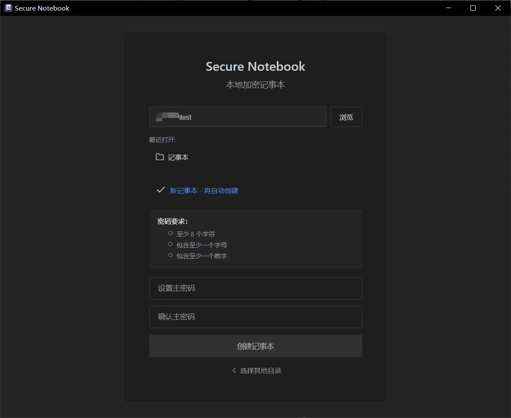
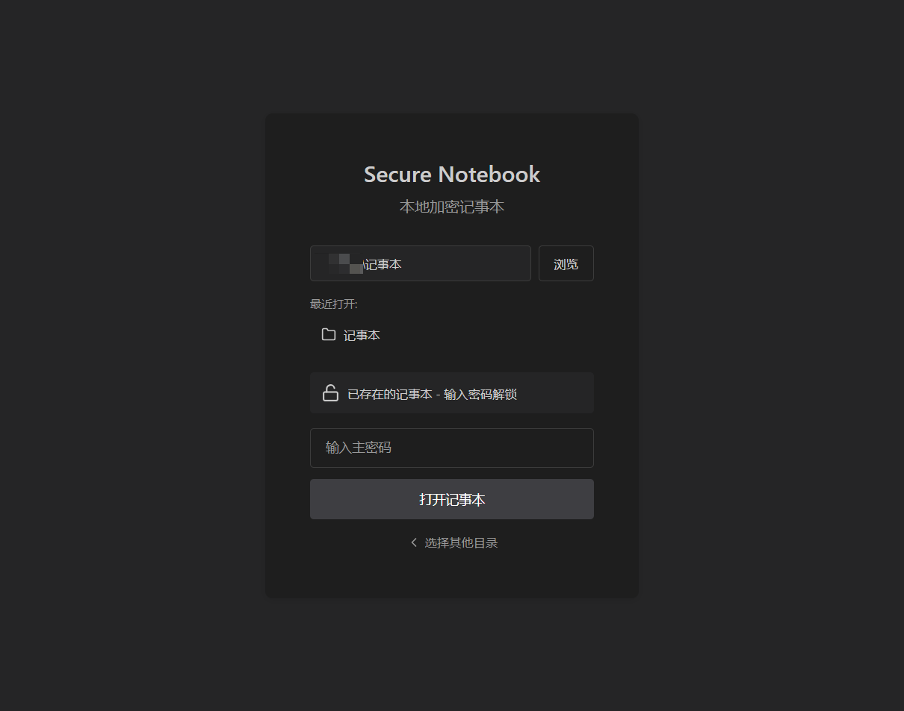
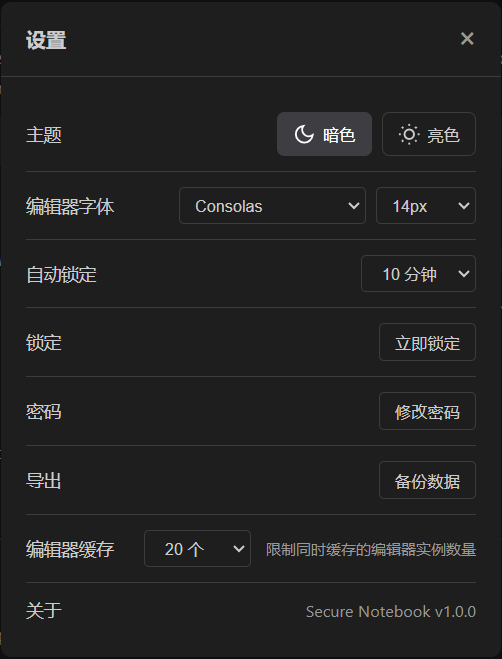
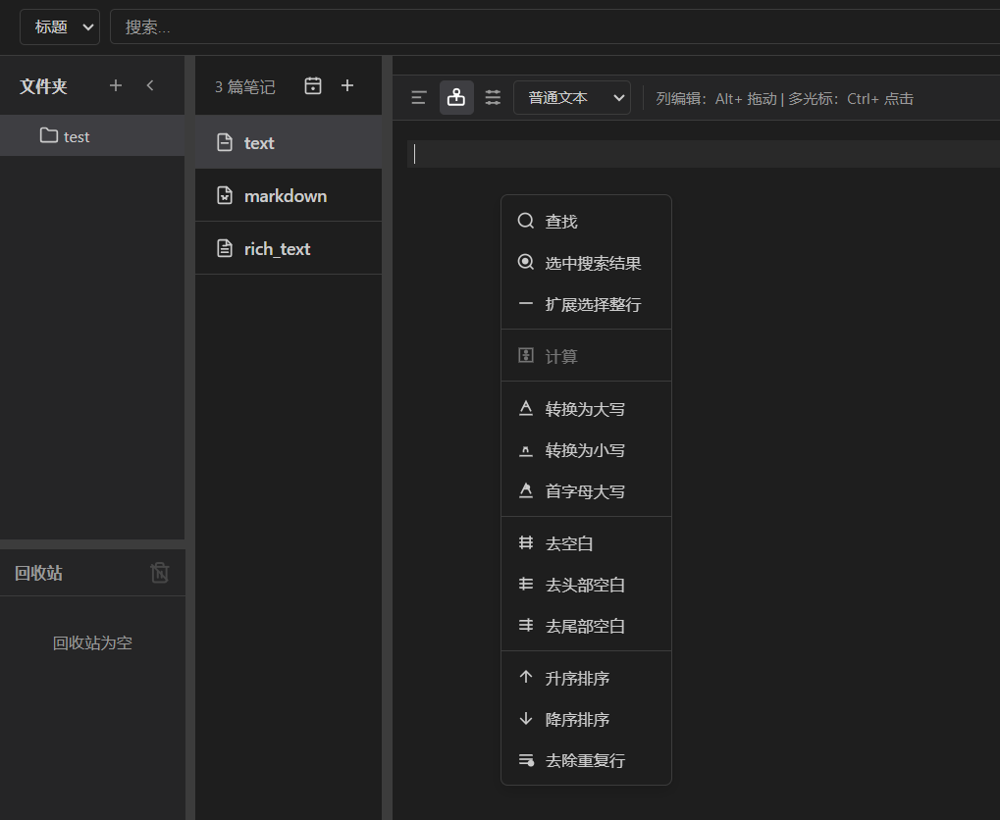
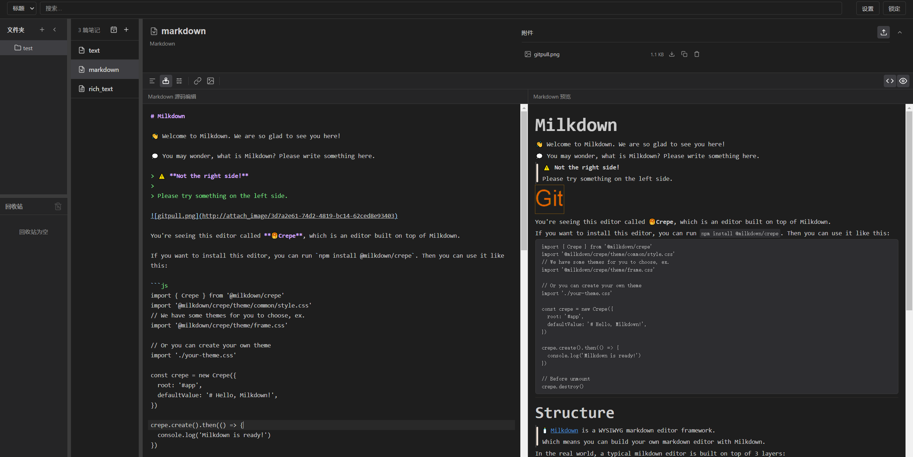
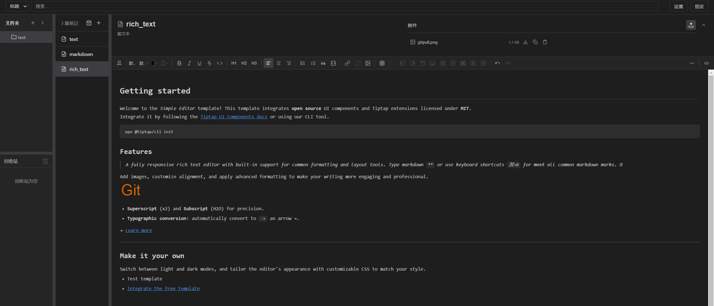

**加密记事本 secure notebook**

# 主密码密钥派生与安全存储

- 使用 **Argon2id**（内存 128MB，迭代 3 次，parallelism 4）从主密码派生 AES-256 主密钥
  - 参数选择参考 OWASP 建议，足以抵抗GPU/ASIC/FPGA 暴力破解
  - Salt 存储在 `userData/vault.salt`，128 位随机 Salt，首次创建主密码时随机生成
  - 用派生 AES-256 主密钥加密加密密钥，追加在vault.salt
  - 密码修改时先验证旧密码，再用新密码重新加密加密密钥存储，**不重新加密所有内容**。
- **用户主密码不保存在任何地方**——不存储明文，不存储哈希，不存储派生过程中的任何中间值
- 验证通过后 AES-256 主密钥存入主进程内存（heap），永不写入磁盘
- 应用退出、锁定或崩溃时，主密钥由 Node.js 内存管理自动清除（不依赖显式清零）

# 验证和解密过程
- **vault.salt**：salt (16) + ... + test_vector (32) + ... + encrypted_masterKey (32) = 共144
  - Salt：128 位随机 Salt，首次创建主密码时随机生成
  - IV：128 位随机 IV，用于 AES-256-GCM 加密 test_vector
  - test_vector：SHA-256_hash（派生 AES-256 主密钥 + Salt，用 AES-256-GCM 加密
  - **验证流程（必须完整比对内容才能判断密钥正确性）**：
    1. 用户输入密码 P' → Argon2id(P', Salt) → 派生 AES-256 主密钥 K'
    2. 用 K' 和 IV 通过 AES-256-GCM 解密 test_vector → 得到 H'
    3. 独立计算 SHA-256(K' + Salt, 100000 次) → 得到 H_expected
    4. H' == H_expected → 主密钥正确 → 解锁成功
    5. 任何一步不匹配 → 解锁失败
  - **设计优势**：攻击者绕过 Argon2id 派生主密钥直接破解成本极高；绕过Argon2id 派生主密钥, 直接对密文尝试， 需要 2^256 次尝试

# 风险提示
> [!WARNING]
> ⚠️ 密码丢失或vault.salt文件损坏，将无法解密。没有任何其他恢复方式。

# 存储结构
```
userData/
├── vault.salt              -- 128位Salt (16字节) + IV (16字节) + test_vector密文 (32字节) + 加密的加密密钥(32字节)
├── metadata.json           -- 笔记和目录列表数据（标题加密）
├── contents/
│   └── {尾2字符哈希}/
│       └── {note_id}.enc   -- 全加密
└── attachments/
    └── {尾2字符哈希}/
        └── {attachment_id}.enc -- 全加密
```
# 部分截图
创建笔记目录  


解锁笔记目录  


设置  


文本编辑器  


markdown编辑器  


富文本编辑器  

